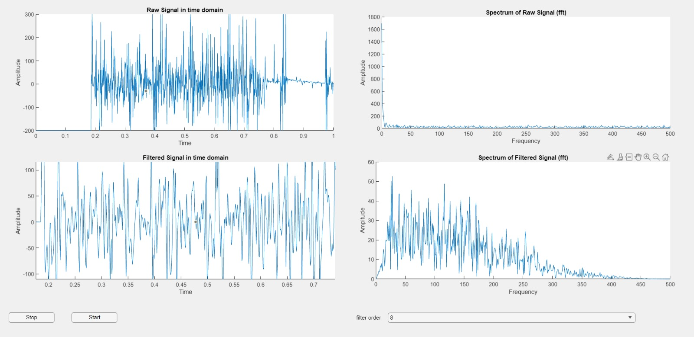
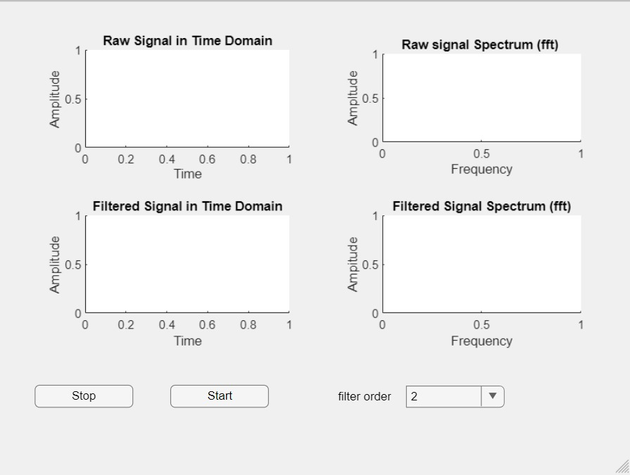
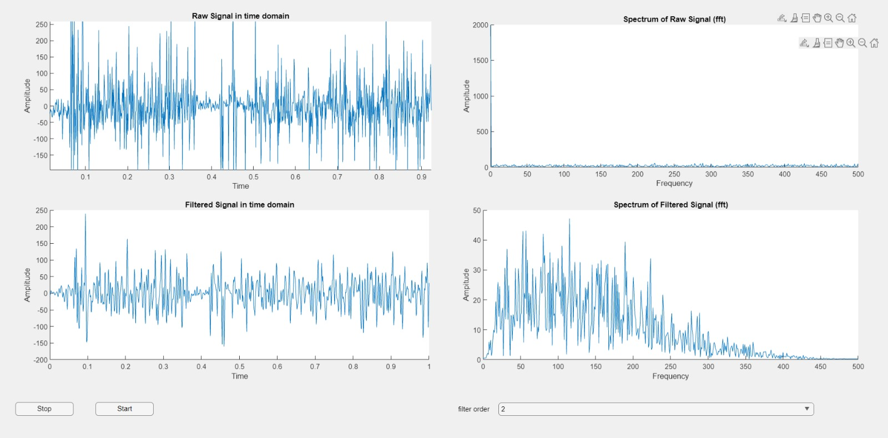

# Electronic-Stethoscope-for-heart-beat-and-respiration-system
In this project, we made a digital stethoscope using simple electronic elements. The goal of this project is to create a digital stethoscope that can assess lung function, heart rate, and other parameters. sounds of an organ. The sound waves are first filtered and amplified by the gadget before being played back through speakers.

The gadget also transmits digital data to a computer for further uses, such as real-time signal monitoring.
Developed by :- Husein mohamed faarah, Abdullah Rihawi & Fatma nur öksüm.

  
